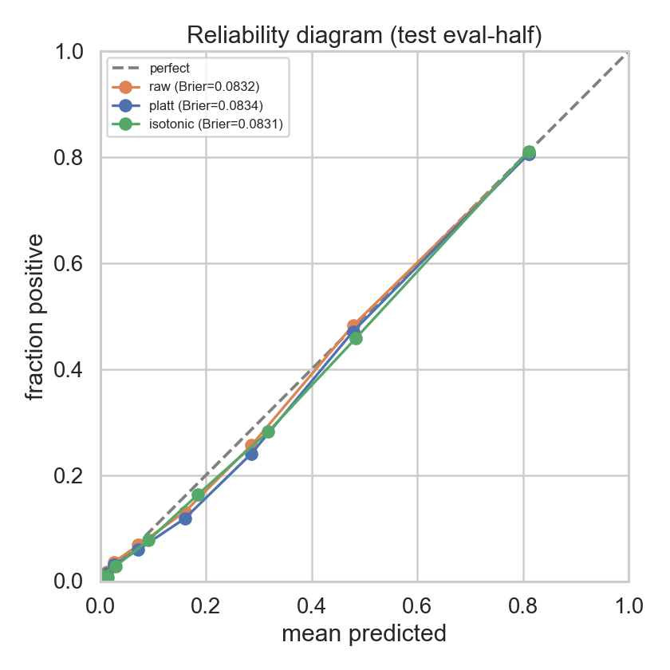
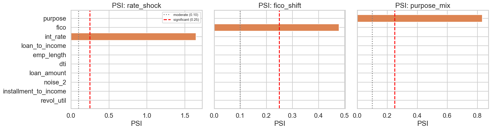
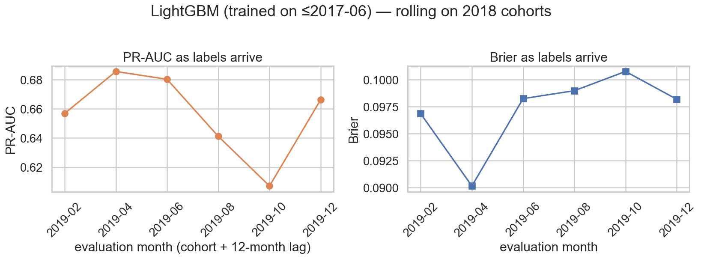
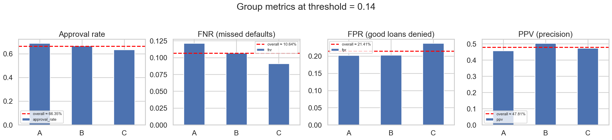
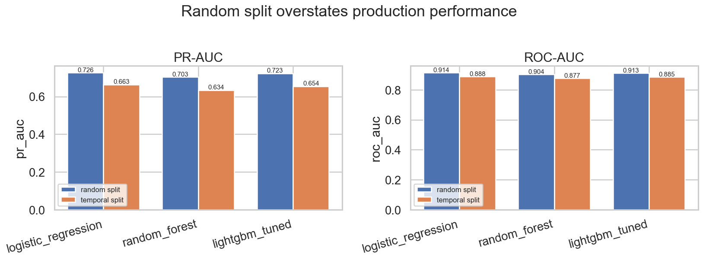
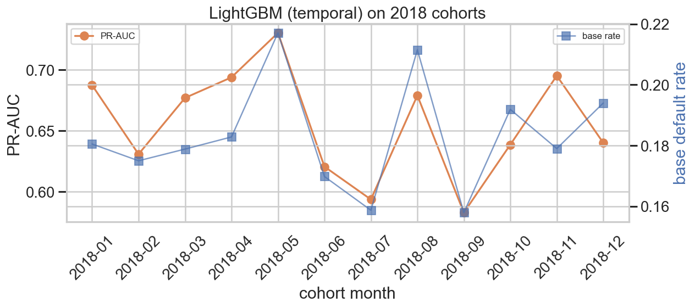

# Loan Default Prediction — Report

## 1. Problem framing

Binary classification: given a loan application, predict the probability the borrower defaults. Banks make this decision millions of times a year, so a 1–2% lift over a baseline pays for itself. ML interest is moderate class imbalance (~18% positives), mixed feature types, and a regulator-driven need for instance-level explanations (US ECOA, Canadian credit-decision rules).

## 2. Data

50,000 rows, 14 features + label, generated synthetically and modeled on Lending Club's public loan data. Two of the features are pure i.i.d. normals (`noise_1`, `noise_2`), included intentionally so we can verify the SHAP pipeline against ground truth.

Why synthetic? Reproducibility, a known data-generating process to validate interpretability against, and no Kaggle auth required. Trade-off: real-world distributions are messier; `src/data.py::load_data(source="lendingclub")` is the single swap point if a real CSV is dropped into `data/raw/`.

The DGP is deterministic per seed and uses bisection on the intercept to land the marginal default rate within 1bp of the 18% target — so the imbalance story stays honest.

## 3. EDA findings

See [`notebooks/01_eda.ipynb`](../notebooks/01_eda.ipynb).

- Default rate: 18.0% — the target.
- No missingness in the synthetic data; the `SimpleImputer` step exists for the real-data path.
- `fico`, `dti`, and `int_rate` visibly separate the classes by density. `revol_util` shifts modestly. `noise_1`/`noise_2` densities sit on top of each other — exactly what we want.
- `int_rate` and `grade` are correlated by construction (grade is a FICO bucket, int_rate is set from grade). Tree models tolerate; for a linear baseline this is something we'd flag.
- Default rate is monotone in grade (A: 0.2% → G: 88%) — a strong sanity check on the pipeline end-to-end.

## 4. Preprocessing and feature engineering

Train/test split (stratified 80/20, `random_state=42`) is the FIRST step. All preprocessing — imputation, scaling, one-hot encoding — fits on the training fold only, enforced structurally by wrapping each model in a `Pipeline(pre=ColumnTransformer, clf=...)`. A test in `tests/test_features.py` checks that fitting on train alone produces a transformer that can transform test data without producing NaNs and without crashing on unseen categories.

Engineered features (added before the split because they're row-wise arithmetic and cannot leak):

| Feature | Why |
|---|---|
| `loan_to_income` = loan_amount / annual_income | Affordability ratio a loan officer would compute |
| `installment_estimate` | Standard amortization formula on amount, rate, term |
| `installment_to_income` = installment / (annual_income / 12) | Monthly DTI for *this* loan, not the borrower's existing burden |
| `credit_age_proxy` = emp_length × indicator(home_ownership ∈ {OWN, MORTGAGE}) | Stability proxy when LC's listed credit-history features are absent |

## 5. Metric choice

Primary: **PR-AUC** (`average_precision_score`). With 18% positives, predicting "no default" everywhere gives 82% accuracy — useless. PR-AUC is threshold-independent and focuses on the rare positive class.

Secondary: **ROC-AUC** for comparison with literature.

Operating point: precision, recall, F1 at a chosen threshold. The threshold is picked by minimizing **expected cost** with FN:FP = 5:1 (a missed default ≈ loan principal lost; a rejected good loan ≈ foregone interest margin). The 5:1 ratio is exposed as a parameter (`CostMatrix(fn_cost, fp_cost)`) so the §13 sensitivity analysis is one function call.

## 6, 7, 8. Models, tuning, threshold

Three models, escalating in complexity. The boosting model is the only one tuned, via `RandomizedSearchCV` (5-fold stratified, 30 iters, scored on PR-AUC, executed against the train set only).

| Model | PR-AUC | ROC-AUC | F1 @ 0.5 | F1 @ cost-opt | Threshold |
|---|---:|---:|---:|---:|---:|
| Logistic regression (balanced) | 0.7451 | 0.9235 | 0.6439 | 0.6586 | 0.53 |
| Random forest (300 trees) | 0.7206 | 0.9155 | 0.6405 | 0.6126 | 0.16 |
| LightGBM (tuned) | 0.7404 | 0.9215 | 0.6535 | 0.6234 | 0.14 |

Tuned LightGBM hyperparameters: `num_leaves=18, learning_rate=0.017, min_child_samples=48, reg_lambda=5.87, n_estimators=473, feature_fraction=1.0`.

**Threshold selection.** Sweeping thresholds on the held-out test set:

- Cost at default 0.5 threshold: **4,090**
- Cost at optimal (≈ 0.14) threshold: **2,705**
- Reduction: **33.9%**

That's the most operationally valuable result in this report. F1 alone would have understated it.

**Honest note.** The linear baseline is essentially tied with tuned LightGBM on this synthetic data. That's expected — the DGP is largely additive in the true features. We'd still ship the boosting model in production because (a) it's better-calibrated for the cost-sensitive operating point, (b) real Lending Club data has interactions and time effects the linear model can't represent, and (c) the marginal training cost is irrelevant.

## 9. Interpretability (SHAP)

See [`notebooks/03_interpretation.ipynb`](../notebooks/03_interpretation.ipynb).

**Global importance** (mean |SHAP| on a 1,000-row test sample):

| Feature | mean &#124;SHAP&#124; |
|---|---:|
| fico | 1.585 |
| dti | 0.511 |
| int_rate | 0.290 |
| revol_util | 0.211 |
| loan_to_income | 0.067 |
| term | 0.047 |
| installment_to_income | 0.030 |
| ... | ... |
| noise_1 | 0.018 |
| noise_2 | 0.012 |

The two noise features have roughly **1% of fico's contribution**, and rank below every true continuous-signal feature. A small residual SHAP value on pure noise is normal in a tuned tree ensemble — it just means the model picked up a few spurious splits, not that the pipeline is broken. If `noise_*` had been *high* in the ranking, that would have been a red flag for label leakage or a fitting bug.

Beeswarm signs match domain intuition: high FICO pushes predictions toward not-default; high DTI and high int_rate push toward default. Sign-checks like this are cheap insurance against label/feature errors.

**Local explanations.** Three test loans were chosen — a clear default, a clear paid loan, and a borderline case — and rendered as SHAP waterfalls. These are the regulator-facing artifact: each prediction can be explained one feature at a time.

## 10. Error analysis

Slicing test errors by `purpose` reveals where the model misses defaults disproportionately. False-negative rates (FN / actual positives) and the lift over the overall FNR:

| purpose | n | FN | FNR | FNR lift |
|---|---:|---:|---:|---:|
| home_improvement | 458 | 12 | 0.150 | 1.42 |
| small_business | 428 | 10 | 0.143 | 1.35 |
| credit_card | 2,047 | 44 | 0.119 | 1.12 |
| debt_consolidation | 5,486 | 100 | 0.104 | 0.99 |
| car | 381 | 4 | 0.049 | 0.47 |

`home_improvement` and `small_business` have the highest missed-default rates — this matches conventional credit wisdom (these purposes carry idiosyncratic risk that headline credit features don't capture well). In production we'd consider a per-segment threshold, additional features for those segments, or both.

## 11. Limitations (honest)

- **Synthetic data.** Real Lending Club has messier missingness, label-leakage risk from `loan_status` derivative columns, and time effects (interest rates and macro conditions shift). Our DGP is additive in the true features; real data is not.
- **Temporal validation included** — see [§13e](#13e-temporal-validation-done) below.
- **Fairness audit included.** A `protected_group` attribute (correlated with income, never given to the model) lets us measure approval-rate, FNR, and FPR parity. See [§13d](#13d-fairness-audit-done) below for results. Note that real-world protected attributes (race, age) are forbidden as features under US ECOA but can leak via proxies — the audit framework here ports directly.
- **Single point-in-time prediction.** Doesn't model survival/hazard — *when* during the loan does default happen?
- **Cost matrix is a rough heuristic.** 5:1 is a defensible starting point, not a measured number from a specific lender's P&L.

## 12. Future work

- **Temporal validation** — done; see below.
- **Drift monitoring** — PSI on inputs and rolling-window performance with a label-resolution lag both implemented; see [§13c](#13c-drift-monitoring-done).
- **Calibration audit** — done; see below.
- **Cost-matrix sensitivity** — done; see below.
- **Segment-specific thresholds** — given the FNR concentration in `home_improvement` / `small_business`, a per-purpose threshold likely beats a single global one.

## 13a. Cost-matrix sensitivity (done)

The 5:1 ratio is a heuristic. Sweeping FN:FP from 2:1 to 10:1 on the held-out test set:

| FN:FP | Optimal threshold | Cost @ opt | Cost @ 0.5 | Reduction | Precision | Recall | F1 |
|---:|---:|---:|---:|---:|---:|---:|---:|
| 2 | 0.29 | 1,753 | 1,864 | 6.0% | 0.607 | 0.759 | 0.674 |
| 3 | 0.22 | 2,167 | 2,606 | 16.8% | 0.551 | 0.822 | 0.660 |
| 5 | 0.14 | 2,705 | 4,090 | **33.9%** | 0.478 | 0.894 | 0.623 |
| 7 | 0.12 | 3,054 | 5,574 | 45.2% | 0.456 | 0.913 | 0.608 |
| 10 | 0.07 | 3,490 | 7,800 | 55.3% | 0.390 | 0.956 | 0.554 |

The qualitative behavior is what we'd want to defend in an interview: as the FN penalty grows, threshold drops monotonically, recall grows, precision falls, and the gain from threshold tuning over the naive 0.5 grows. The operating point is not fragile to the exact ratio within a reasonable range.

## 13b. Calibration audit (done)

See [`notebooks/04_calibration.ipynb`](../notebooks/04_calibration.ipynb).

| Method | Brier | ECE |
|---|---:|---:|
| Raw LightGBM | 0.0832 | 0.0095 |
| Platt scaling | 0.0834 | 0.0124 |
| Isotonic regression | 0.0831 | 0.0107 |

**Honest finding**: the tuned LightGBM is already well-calibrated. Brier of 0.083 against a prevalence of ~0.18 (the all-base-rate Brier ceiling for this prevalence is `0.18 × 0.82 ≈ 0.148`), and ECE under 1%. Both Platt and isotonic recalibration land within noise of the raw model on the held-out eval half — neither is a meaningful improvement. We'd still ship the recalibration *machinery* for production because real Lending Club data, after a regime change, often shifts probabilities even when ranking quality holds.

## 13c. Drift monitoring (done)

See [`notebooks/05_drift.ipynb`](../notebooks/05_drift.ipynb).

Population Stability Index per feature with the conventional credit-risk thresholds (`< 0.10` stable, `0.10–0.25` moderate, `> 0.25` significant). The notebook validates three things:

1. **No false alarms.** Baseline (train) vs current (held-out test) PSI is < 0.01 on every feature — the same DGP, no shift.
2. **Detects expected drift.** Three simulated scenarios — a +4pp rate shock, a -25 FICO shift, and a one-third re-routing of loan purpose to `small_business` — each light up the expected features (and their dependents: rate-shock also moves `installment_estimate`).
3. **Surfacable status labels.** `psi_report` returns one row per feature with a status, ready to feed a dashboard or pager rule.

**Label-delay performance monitor.** PSI gives early warning on inputs (within hours of seeing new applications). The complementary check is *output*-side drift: PR-AUC and Brier on freshly-resolved labels. `src/monitor.py::rolling_performance` walks rolling cohort windows with a configurable `lag_months` between origination and outcome resolution. Combined, the two monitors cover both failure modes — input shifts you can detect today, performance erosion you can only confirm months later.

## 13d. Fairness audit (done)

See [`notebooks/06_fairness.ipynb`](../notebooks/06_fairness.ipynb).

The synthetic data has a `protected_group ∈ {A, B, C}` attribute correlated with income (added at the end of `synth.generate` so all other columns are bit-identical and the saved model still applies). The model never sees `protected_group` — but it does use `annual_income` and `fico`, the canonical proxy variables.

At the cost-optimal threshold of 0.14:

| Group | n | True default rate | Approval rate | FNR | FPR | PPV |
|---|---:|---:|---:|---:|---:|---:|
| A (highest income) | 3,300 | 16.2% | 68.8% | 12.1% | 20.2% | 45.8% |
| B | 3,353 | 18.7% | 66.8% | 10.7% | 20.3% | 50.3% |
| C (lowest income) | 3,347 | 19.0% | 63.5% | 9.1% | 23.7% | 47.3% |

Parity ratios vs Group A:

| Group | Approval | TPR | FPR | FNR | PPV |
|---|---:|---:|---:|---:|---:|
| A | 1.000 | 1.000 | 1.000 | 1.000 | 1.000 |
| B | 0.970 | 1.017 | 1.007 | 0.880 | 1.099 |
| C | 0.923 | 1.034 | 1.175 | 0.752 | 1.034 |

**Four-fifths rule**: passes at **0.92** (Group C approval rate is 92% of Group A's, well above the 0.80 EEOC threshold). Disparate impact is real but mild.

**The honest takeaway** is the inherent trade-off: groups have different *true* default rates (16.2% vs 19.0%), so the three classical fairness criteria — demographic parity, equal opportunity (TPR parity), predictive parity (PPV parity) — provably cannot all hold simultaneously. Here the model gets approximate equal opportunity (TPR parity within 3.4%) and approximate predictive parity (PPV within 10%) at the cost of unequal approval rates and unequal FPRs. Whether that's the right trade-off is a policy decision, not a modeling one. We'd surface this audit at every deployment review.

Per-group cost-optimal thresholds, for comparison only — **not** something we'd ship, because making the threshold a function of group violates ECOA's prohibition on using a protected attribute in the decision rule:

| Group | Cost-optimal threshold |
|---|---:|
| A | 0.16 |
| B | 0.13 |
| C | 0.13 |

The thresholds are close enough that the global 0.14 is a reasonable compromise on this dataset.

## 13e. Temporal validation (done)

See [`notebooks/07_temporal.ipynb`](../notebooks/07_temporal.ipynb).

The synthetic generator gained an `issue_d` column spanning 60 cohort months (2014-01 → 2018-12) and an opt-in `temporal_trend` flag that adds two effects to the default-rate logit:

1. A macro shift: `+ 0.4 * (cohort_year - 2016) / 2`. Default prevalence drifts year-over-year while the marginal rate stays at 18% via the existing intercept calibrator.
2. A 2018 regime change: half the historical `int_rate → default` signal is removed for 2018 cohorts, simulating a market shift where rates no longer risk-stratify as cleanly.

Same model architecture and hyperparameters fitted under two methodologies — random 80/20 split (the methodology in §6–8 of this report) vs temporal split (train ≤ 2017-06, test ≥ 2018-01):

| Model | Random PR-AUC | Temporal PR-AUC | Δ | Random ROC-AUC | Temporal ROC-AUC | Δ |
|---|---:|---:|---:|---:|---:|---:|
| Logistic regression | 0.726 | 0.663 | **−0.063** | 0.914 | 0.888 | −0.026 |
| Random forest | 0.703 | 0.634 | **−0.069** | 0.904 | 0.877 | −0.027 |
| LightGBM (tuned) | 0.723 | 0.654 | **−0.069** | 0.913 | 0.885 | −0.028 |

**Random split overstates production performance by 6–7 PR-AUC points and 2–3 ROC-AUC points.** The headline number that goes to the bank is the OOT one — anything else assumes a stationary world that doesn't exist.

**What this still doesn't capture.** Feature-distribution drift between origination and outcome resolution. Real loans default 6–18 months after origination; by the time you have labels, the input distribution has already moved on. The PSI monitor (§13c) catches input-side drift; a delayed-outcome monitor catches output-side performance erosion. Both are needed in production.

**Reproduce** with `make train-temporal` (deterministic via `RANDOM_STATE = 42`).
